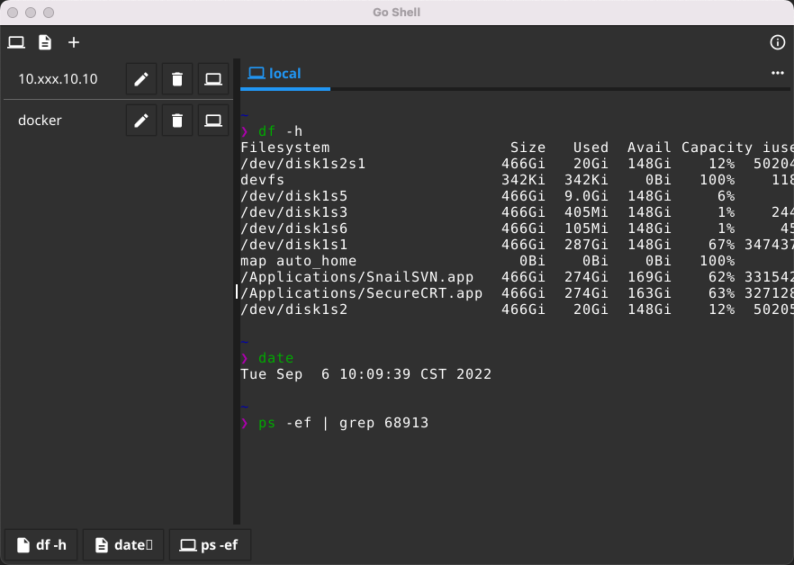
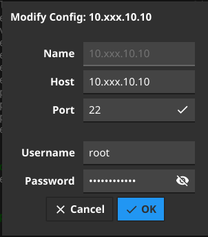
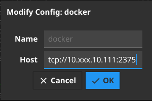
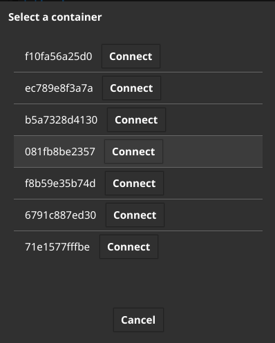
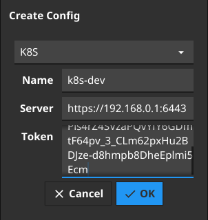
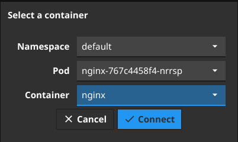

# GoShell(WIP)

GoShell is a simple terminal GUI client, written in Go,via [Fyne](https://fyne.io). Supports SSH、Docker、K8S.


# Features

- Supports SSH、Docker、K8S(coming soon).
- Supports Windows、Linux、MacOS platform.（thanks [Fyne](https://fyne.io)）
- Supports shortcut command.

# Screenshots
### Main

### SSH Config

### Docker Config

### Docker Select Container

### K8S Config

### K8S Select Container


### Building

- Linux / MACOS
``` shell
    git clone https://github.com/tk103331/goshell.git
    cd goshell
    go build
    sudo ./goshell
```
- Windows (Need to run with administrator rights)
``` shell
    git clone https://github.com/tk103331/goshell.git
    cd goshell
    go build
    goshell
```

# TODOs

- UI/UX optimization
- Configuration encryption 
- ~~Supports K8S pod.~~
